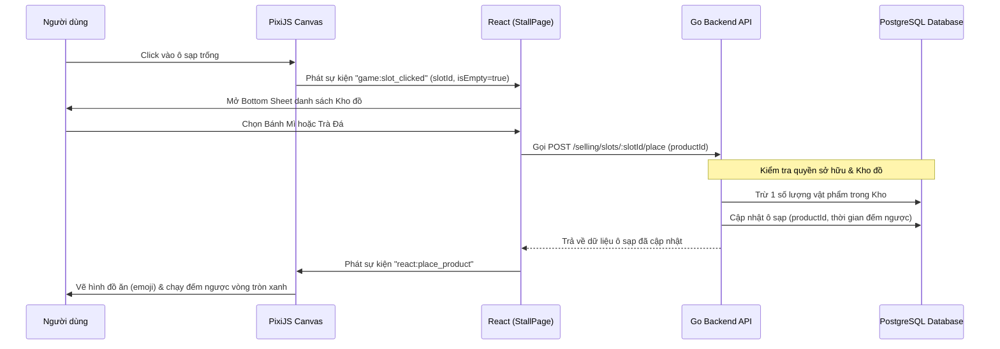

# Project Plan - Item Placement Mechanism Explanation

This document details the end-to-end mechanism of how an item is placed onto an empty slot in the Hàng Rong application, covering the database, API, React state, and PixiJS canvas.

## End-to-End Placement Flow

---

## Technical Details

### 1. Database Schema
*   **Inventory (Kho đồ)**: Tracks `quantity` of each item. Decrements by 1 when placed.
*   **Stall Slots (Ô sạp)**: Stores `productId`, `productName`, `productIcon`, `totalTime`, and `timeRemaining`.

### 2. Frontend React Mutation
*   Located in `useStall.ts` -> `placeProductMutation`.
*   Triggers API call and invalidates React Query cache (`"stallSlots"` & `"inventory"`) to refresh inventory quantities.

### 3. PixiJS Canvas Rendering
*   Located in `StallScene.ts` -> `placeProduct` method.
*   Clears the empty `"TRỐNG"` label and draws the product emoji with a soft orange outline.
*   Starts the tick loop to animate the green progress border arc as `timeRemaining` decrements.
